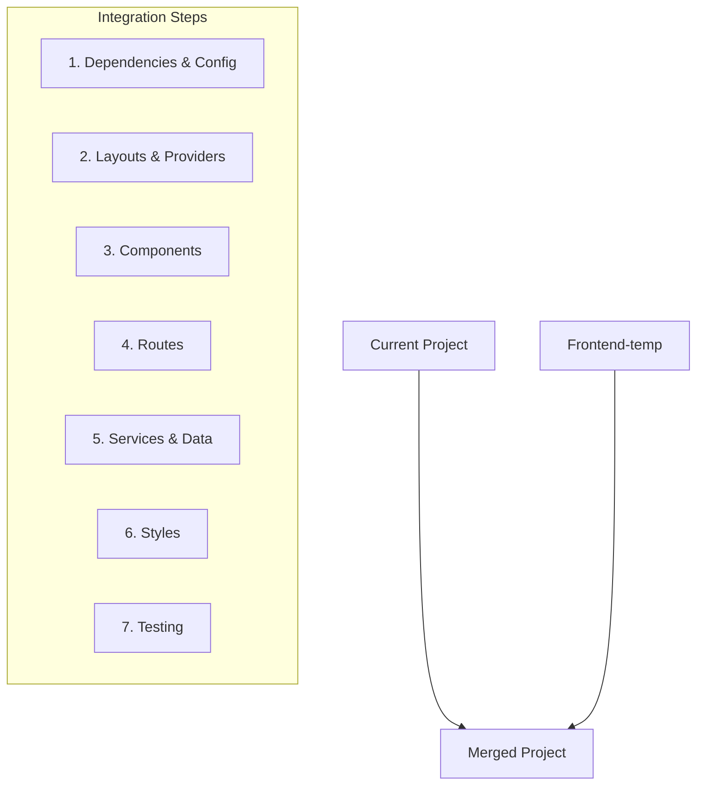

# Integration Plan: Merging frontend-temp into main project

Based on analysis of both codebases, this document outlines the key components and challenges for integrating the frontend-temp sports betting UI into the current Next.js application with authentication, database, and payment features.

## 1. Project Analysis Summary

**Current Project:**
- Next.js application with auth, Drizzle DB, and Stripe payments
- Uses Manrope font and Tailwind CSS
- Has dashboard and login route groups
- Uses Radix UI components
- Has user authentication and session management

**Frontend-temp:**
- Sports betting UI with league pages, best bets, history views
- Uses Geist font family and custom CSS
- Has mock data and game services
- Different UI component structure
- Different layout organization

## 2. Integration Strategy

### Step 1: Dependencies & Configuration
- Merge package.json dependencies
- Update tailwind.config.ts to include frontend-temp paths
- Update tsconfig.json with any necessary path aliases
- Keep Next.js configuration from main project

### Step 2: Layouts & Providers
- Modify root layout to:
  - Include both font families (Manrope + Geist)
  - Integrate frontend-temp providers with auth providers
  - Maintain authentication flow
- Modify dashboard layout to incorporate frontend-temp navigation

### Step 3: Component Integration
- Move frontend-temp/components to components/sports/
- Resolve component naming conflicts
- Maintain UI consistency between the two sets of components
- Update component imports in frontend-temp code

### Step 4: Route Integration
- Move frontend-temp pages into the dashboard route group
- Ensure auth protection for all sports betting routes
- Update navigation references

### Step 5: Services & Data Integration
- Move frontend-temp services to lib/sports/
- Connect mock data services to authentication context
- Plan pathway to replace mock data with real API when ready

### Step 6: Style Integration
- Move custom CSS from frontend-temp to appropriate locations
- Update global CSS to incorporate all styles
- Ensure theme system works across both UIs

### Step 7: Testing & Quality Assurance
- Test all routes and functions
- Verify authentication works with new routes
- Check responsive design
- Verify theme consistency

## 3. Key Challenge Areas

1. **Authentication Integration:** Ensuring sports betting UI works with the existing auth system
2. **Component Consistency:** Both projects have UI components that may need harmonization
3. **Styling Conflicts:** Managing different font families and style approaches
4. **Provider Integration:** Combining theme, auth, and game service providers
5. **Route Organization:** Fitting sports betting routes into the current route structure
